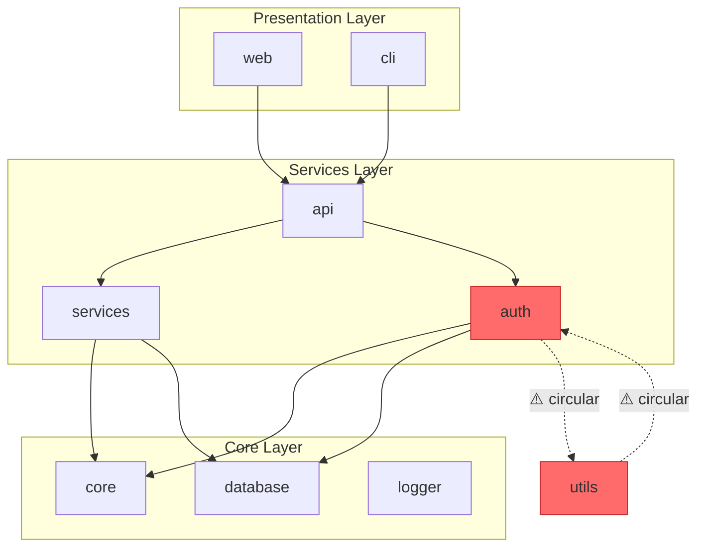
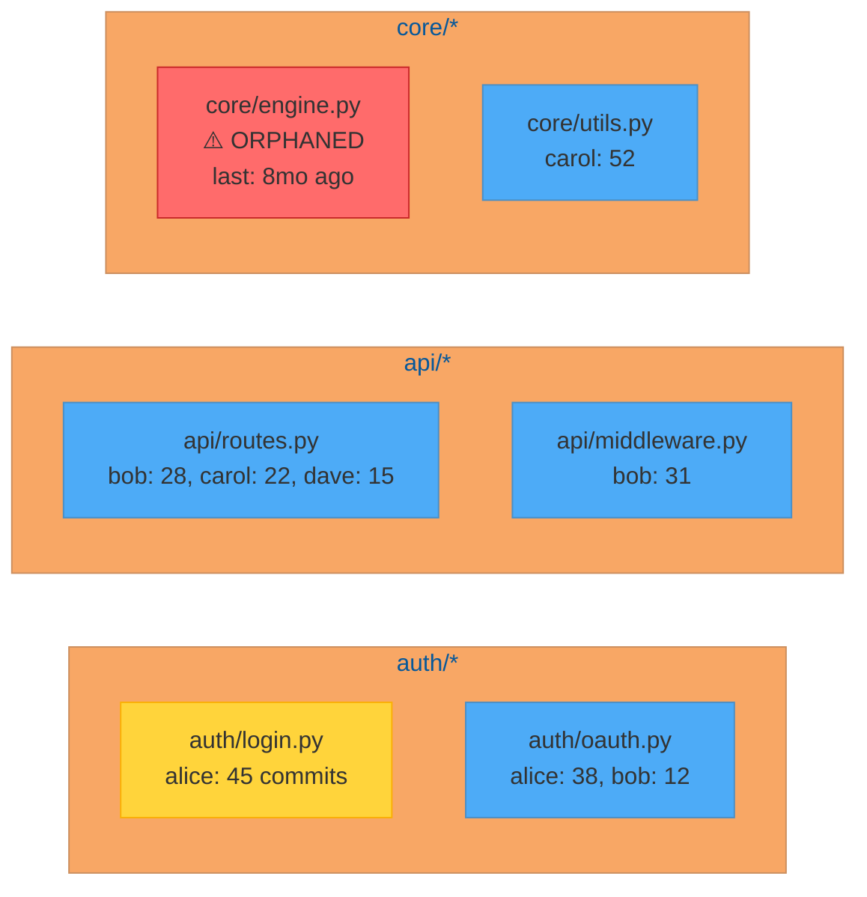
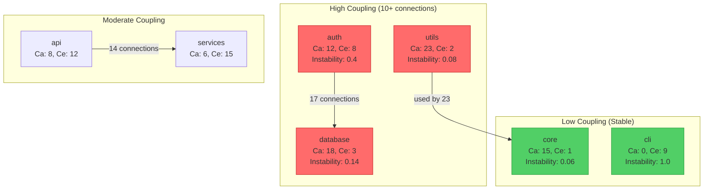
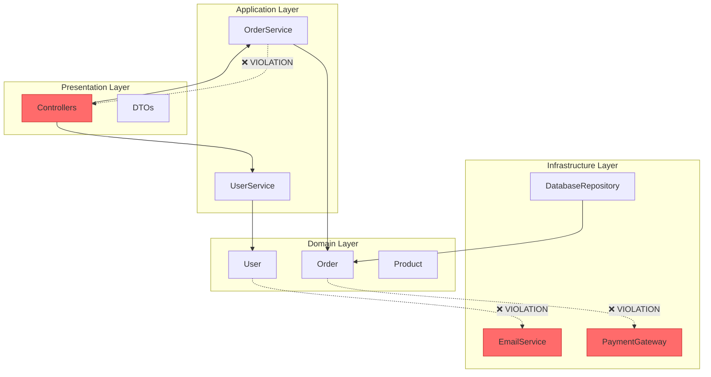

# SKILL: Codebase Visualization

## Trigger
When asked to:
- Understand codebase structure and relationships
- Visualize module dependencies and coupling
- Identify code ownership and knowledge distribution
- Check architecture layer compliance
- Prepare for onboarding or major refactoring
- Assess codebase health before making changes

## Purpose
This skill generates visualizations that provide **complete understanding of a codebase** so that anyone updating it can work effectively. Focus is on structural understanding, not runtime behavior.

---

## Core Visualizations (Priority Order)

These four visualizations are essential for codebase understanding:

### 1. Dependency Graph (Highest Priority)

**Why First**: Shows the shape of the codebase at a glance. Essential before any change.

**Visualizes**: Directed graph with nodes = modules/packages, edges = imports/dependencies

**Data Sources**: Static import analysis

**Questions Answered**:
- What is the overall structure?
- Are there circular dependencies?
- Which modules are most depended upon (core)?
- Which modules are leaf nodes (isolated)?
- Where are the natural boundaries?

**Most Valuable**: 
- Before any refactoring
- Onboarding new developers
- Architecture reviews
- Microservice extraction planning

**Tools by Language**:
- **JavaScript/TypeScript**: `dependency-cruiser`, `madge`
- **Python**: `pydeps`, `import-linter`
- **Go**: `go mod graph`, `godepgraph`
- **Rust**: `cargo-depgraph`, `cargo-modules`
- **Java**: `jdeps`, ArchUnit
- **C#/.NET**: `dotnet list package`, NDepend
- **Swift**: `swift package show-dependencies`
- **Kotlin**: Konsist, ArchUnit-Kotlin
- **C/C++**: `include-what-you-use`, CMake graphs
- **Dart/Flutter**: `dart pub deps`, `lakos`

**Mermaid Output**:


**Text Summary**:
```
Total modules: 47
Circular dependencies: 2 (auth ↔ utils)
Core modules (depended by 5+): core, database, logger
Leaf modules (no dependents): cli, webhooks, reports
Suggested boundaries: [auth/*], [api/*], [services/*]
```

---

### 2. Code Ownership Heatmap

**Why Important**: Reveals who knows each module. Critical for knowing who to ask and identifying orphaned code.

**Visualizes**: Matrix of Files × Authors, color intensity = commit frequency

**Data Sources**: Git log (`git shortlog`, `git log --numstat`)

**Questions Answered**:
- Who are the knowledge holders for each module?
- Are there orphaned modules (no active owners)?
- Is knowledge distribution healthy or concentrated?
- What is the bus factor for critical modules?

**Most Valuable**:
- Teams 5+
- Onboarding planning
- Before team member departure
- Identifying documentation needs

**Tools**:
- `git-quick-stats`
- GitHub Insights (Contributors tab)
- GitLab Analytics (Contributors)
- Codecov ownership analysis
- Custom: `git log --numstat --author="<author>" -- <path>`

**Mermaid Output**:


**Text Summary**:
```
Modules with single owner (risk): 12
Orphaned modules (no commits in 6mo): 3
  - legacy/migration.js
  - utils/deprecated.py
  - internal/old_handler.go
Knowledge concentration:
  - auth/*: 87% by alice
  - api/*: distributed across 4 developers
Bus factor < 2: auth, payments, notifications
```

---

### 3. Module Coupling Heatmap

**Why Important**: Shows hidden connections. Prevents "I changed X, why did Y break?" surprises.

**Visualizes**: Matrix of modules × modules, color = number of connections (imports, calls, shared types)

**Data Sources**: Import analysis, call graph, type reference analysis

**Questions Answered**:
- Which modules are tightly coupled?
- Where should boundaries be strengthened?
- Which changes will have wide blast radius?
- Are there unexpected cross-cutting dependencies?

**Most Valuable**:
- Refactoring planning
- Microservice extraction
- Before major changes
- Architecture improvement

**Tools**:
- Custom scripts (most common)
- NDepend (C#)
- Understand (commercial, multi-language)
- SonarQube coupling analysis
- IDE dependency analysis

**Metrics to Include**:
- **Afferent coupling (Ca)**: How many depend on this module
- **Efferent coupling (Ce)**: How many this module depends on
- **Instability (Ce / (Ca + Ce))**: 0 = stable, 1 = unstable
- **Abstractness**: Ratio of abstract to concrete types

**Mermaid Output**:


**Text Summary**:
```
Highly coupled pairs (10+ connections):
  - auth ↔ database (17 connections)
  - api → services (14 connections)
  - utils → * (used by 23 modules)

Instability scores:
  - core: 0.1 (stable, many depend on it)
  - cli: 0.9 (unstable, depends on many)
  - utils: 0.0 (maximally stable)

Suggested decoupling targets:
  1. Extract shared types from utils
  2. Introduce interface between auth/database
  3. Reduce api → services coupling
```

---

### 4. Architecture Layer Compliance

**Why Important**: Reveals boundary violations — shortcuts that became permanent. Helps avoid making things worse.

**Visualizes**: Matrix or violation graph showing calls that shouldn't exist based on layer rules

**Data Sources**: Dependency analysis with defined layer rules

**Questions Answered**:
- Are layer boundaries being respected?
- How many violations exist and where?
- Are violations increasing or decreasing?
- Which layers are most problematic?

**Most Valuable**:
- Projects with defined architecture (hexagonal, layered, clean)
- Architecture governance
- Before accepting PRs
- Long-term codebase health

**Tools by Language**:
- **JavaScript/TypeScript**: `dependency-cruiser` with rules
- **Python**: `import-linter`
- **Java**: ArchUnit
- **Kotlin**: ArchUnit-Kotlin, Konsist
- **C#/.NET**: NDepend rules
- **Go**: Custom rules with `go vet` or external tools
- **Rust**: Custom with `cargo-modules`

**Common Layer Patterns**:
```
Clean Architecture:
  Domain ← Application ← Infrastructure ← Presentation
  (inner layers should not depend on outer)

Hexagonal:
  Core ← Ports ← Adapters
  (core should not depend on adapters)

Layered:
  Presentation → Business → Data → Infrastructure
  (upper can depend on lower, not reverse)
```

**Mermaid Output**:


**Text Summary**:
```
Total violations: 14 (down from 23 last month)

Violations by layer:
  - Domain → Infrastructure: 5 (CRITICAL)
  - Domain → Presentation: 2 (CRITICAL)
  - Business → Presentation: 4 (MODERATE)
  - Data → Business: 3 (MODERATE)

Specific violations:
  1. domain/User.java → infrastructure/EmailService.java
  2. domain/Order.java → infrastructure/PaymentGateway.java
  3. business/OrderService.java → presentation/OrderController.java

Recommended fixes:
  1. Introduce port/interface in domain for email
  2. Use dependency injection for payment
  3. Return DTOs from service layer
```

---

## Process — follow in order, no skipping

### 1. Generate Dependency Graph First

This is the foundation. Without it, other visualizations lack context.

**Mermaid Generation**:
```bash
# JavaScript/TypeScript - dependency-cruiser with Mermaid output
npx dependency-cruiser --output-type mmd src > deps.mmd

# Python - pydeps with mermaid
pydeps myproject --no-output -T mmd -o deps.mmd

# Go - custom script to generate mermaid
go mod graph | awk '{print $1 " --> " $2}' > deps.mmd

# Rust - cargo-depgraph
cargo depgraph --all-deps | dot -T mmd -o deps.mmd
```

**Manual Mermaid Template**:
```mermaid
graph TD
    [module_name] --> [dependency]
```

### 2. Analyze Code Ownership

```bash
# Quick ownership scan
git log --numstat --format="%a" -- . | sort | uniq -c | sort -rn

# Per-directory ownership
for dir in src/*/; do
  echo "=== $dir ==="
  git shortlog -sne -- "$dir"
done

# Find orphaned files (no commits in 6 months)
git log --since="6 months ago" --name-only --format="" | sort -u > recent.txt
git ls-files | sort > all.txt
comm -23 all.txt recent.txt
```

### 3. Generate Coupling Heatmap

Requires more tooling. Use language-specific tools or custom scripts.

### 4. Check Layer Compliance

Requires defined layer rules. If none exist, infer from directory structure.

### 5. Produce Combined Report

Integrate all four visualizations into a single codebase understanding document.

---

## Seamless Automation

### Event-Driven Trigger System

Each graph is generated automatically based on relevant events — no manual triggers or scheduled jobs required.

#### Trigger Events by Graph Type

| Graph | Trigger Events | Detection Method |
|-------|---------------|------------------|
| **Dependency Graph** | New dependency added, module created/renamed, PR to core modules | `package.json`, `go.mod`, `Cargo.toml` changes; new directories |
| **Code Ownership** | Team member added/removed, PR merged, new module created | `MEMBERS` file, merge commits, new directories |
| **Module Coupling** | Interface changes in core, new cross-module imports, refactor PR | Core module file changes, import pattern detection |
| **Layer Compliance** | Any PR, new layer rule added | All file changes in watched paths |

#### Comprehensive Trigger Matrix

```
Event                          | Dep Graph | Ownership | Coupling | Compliance |
-------------------------------|-----------|-----------|----------|------------|
PR opened                      | ✅        | ❌        | ⚠️*      | ✅         |
PR merged                      | ❌        | ✅        | ✅       | ❌         |
New dependency file changed    | ✅        | ❌        | ❌       | ❌         |
Core module changed            | ✅        | ❌        | ✅       | ✅         |
New module/directory created   | ✅        | ✅        | ❌       | ❌         |
Team member added/removed      | ❌        | ✅        | ❌       | ❌         |
Layer rule file changed        | ❌        | ❌        | ❌       | ✅         |
Refactor label on PR           | ✅        | ❌        | ✅       | ✅         |
Onboarding issue created       | ❌        | ✅        | ✅       | ✅         |
Architecture decision merged   | ✅        | ❌        | ✅       | ✅         |

⚠️* = Only if PR has "refactor" label or touches core modules
```

### CI/CD Workflows

#### Primary Workflow (PR-based)

```yaml
# .github/workflows/codebase-viz.yml
name: Codebase Visualization

on:
  pull_request:
    types: [opened, synchronize, labeled]
  push:
    branches: [main]
    paths:
      - '**/package.json'
      - '**/go.mod'
      - '**/Cargo.toml'
      - 'src/core/**'
      - 'lib/core/**'
      - '.dependency-cruiser.js'
      - '.layer-rules.*'

jobs:
  detect-changes:
    runs-on: ubuntu-latest
    outputs:
      needs_dep_graph: ${{ steps.check.outputs.dep_graph }}
      needs_ownership: ${{ steps.check.outputs.ownership }}
      needs_coupling: ${{ steps.check.outputs.coupling }}
      needs_compliance: ${{ steps.check.outputs.compliance }}
    steps:
      - uses: actions/checkout@v4
        with:
          fetch-depth: 0
      
      - id: check
        run: |
          # Check what needs to be generated
          if git diff --name-only HEAD~1 HEAD | grep -qE '(package.json|go.mod|Cargo.toml|requirements.txt)'; then
            echo "dep_graph=true" >> $GITHUB_OUTPUT
          fi
          
          if [[ "${{ github.event_name }}" == "push" ]]; then
            echo "ownership=true" >> $GITHUB_OUTPUT
            echo "coupling=true" >> $GITHUB_OUTPUT
          fi
          
          if git diff --name-only HEAD~1 HEAD | grep -qE '(src/core/|lib/core/)'; then
            echo "coupling=true" >> $GITHUB_OUTPUT
          fi
          
          # Always check compliance on PR
          if [[ "${{ github.event_name }}" == "pull_request" ]]; then
            echo "compliance=true" >> $GITHUB_OUTPUT
            echo "dep_graph=true" >> $GITHUB_OUTPUT
          fi
          
          # Refactor label triggers comprehensive analysis
          if [[ "${{ contains(github.event.pull_request.labels.*.name, 'refactor') }}" == "true" ]]; then
            echo "coupling=true" >> $GITHUB_OUTPUT
          fi

  generate-dependency-graph:
    needs: detect-changes
    if: needs.detect-changes.outputs.needs_dep_graph == 'true'
    runs-on: ubuntu-latest
    steps:
      - uses: actions/checkout@v4
        with:
          fetch-depth: 0
      
      - name: Generate Dependency Graph
        run: |
          npx dependency-cruiser --output-type mmd src > docs/architecture/dependency-graph.mmd
          
      - name: Upload artifact
        uses: actions/upload-artifact@v4
        with:
          name: dependency-graph
          path: docs/architecture/dependency-graph.mmd

  generate-ownership:
    needs: detect-changes
    if: needs.detect-changes.outputs.needs_ownership == 'true'
    runs-on: ubuntu-latest
    steps:
      - uses: actions/checkout@v4
        with:
          fetch-depth: 0
      
      - name: Generate Ownership Heatmap
        run: |
          ./scripts/generate-ownership-heatmap.sh > docs/architecture/ownership-heatmap.mmd
      
      - name: Check bus factor
        id: bus-factor
        run: |
          # Alert if critical modules have bus factor < 2
          ./scripts/check-bus-factor.sh

  generate-coupling:
    needs: detect-changes
    if: needs.detect-changes.outputs.needs_coupling == 'true'
    runs-on: ubuntu-latest
    steps:
      - uses: actions/checkout@v4
      
      - name: Generate Coupling Heatmap
        run: |
          ./scripts/generate-coupling-heatmap.sh > docs/architecture/coupling-heatmap.mmd

  check-compliance:
    needs: detect-changes
    if: needs.detect-changes.outputs.needs_compliance == 'true'
    runs-on: ubuntu-latest
    steps:
      - uses: actions/checkout@v4
      
      - name: Check Layer Compliance
        id: compliance
        run: |
          npx dependency-cruiser --validate --output-type mmd src/.dependency-cruiser.js > docs/architecture/layer-compliance.mmd
          
          # Check for new violations
          VIOLATIONS=$(npx dependency-cruiser --validate src/.dependency-cruiser.js 2>&1 | grep -c "error" || true)
          echo "violations=$VIOLATIONS" >> $GITHUB_OUTPUT
          
          if [ "$VIOLATIONS" -gt 0 ]; then
            echo "::warning::$VIOLATIONS layer compliance violations detected"
          fi
      
      - name: Fail on new violations
        if: steps.compliance.outputs.violations > 0
        run: exit 1

  update-pr-description:
    needs: [generate-dependency-graph, check-compliance]
    if: always() && github.event_name == 'pull_request'
    runs-on: ubuntu-latest
    steps:
      - uses: actions/checkout@v4
      
      - name: Download artifacts
        uses: actions/download-artifact@v4
      
      - name: Update PR description
        uses: actions/github-script@v7
        with:
          script: |
            const fs = require('fs');
            const depGraph = fs.existsSync('dependency-graph/dependency-graph.mmd') 
              ? fs.readFileSync('dependency-graph/dependency-graph.mmd', 'utf8') 
              : null;
            
            let body = context.payload.pull_request.body || '';
            
            // Add or update visualization section
            const vizSection = `
            
            ---
            ## 📊 Codebase Visualizations
            
            ### Dependency Graph
            \`\`\`mermaid
            ${depGraph || '(no changes)'}
            \`\`\`
            `;
            
            // Update PR body
            if (!body.includes('## 📊 Codebase Visualizations')) {
              body += vizSection;
            }
            
            await github.rest.pulls.update({
              owner: context.repo.owner,
              repo: context.repo.repo,
              pull_number: context.issue.number,
              body: body
            });
```

#### Team Event Workflow

```yaml
# .github/workflows/team-events.yml
name: Team Event Handlers

on:
  issues:
    types: [opened, labeled]
  workflow_dispatch:
    inputs:
      event_type:
        description: 'Event type'
        required: true
        type: choice
        options:
          - onboarding
          - offboarding
          - architecture-review

jobs:
  handle-onboarding:
    if: |
      (github.event_name == 'issues' && contains(github.event.issue.labels.*.name, 'onboarding')) ||
      (github.event_name == 'workflow_dispatch' && github.event.inputs.event_type == 'onboarding')
    runs-on: ubuntu-latest
    steps:
      - uses: actions/checkout@v4
        with:
          fetch-depth: 0
      
      - name: Generate Onboarding Report
        run: |
          # Generate all visualizations for new team member
          ./scripts/generate-dependency-graph.sh > docs/architecture/dependency-graph.mmd
          ./scripts/generate-ownership-heatmap.sh > docs/architecture/ownership-heatmap.mmd
          ./scripts/generate-coupling-heatmap.sh > docs/architecture/coupling-heatmap.mmd
          ./scripts/generate-layer-compliance.sh > docs/architecture/layer-compliance.mmd
          
          # Combine into onboarding guide
          ./scripts/create-onboarding-guide.sh > docs/ONBOARDING_GUIDE.md
      
      - name: Comment on issue
        if: github.event_name == 'issues'
        uses: actions/github-script@v7
        with:
          script: |
            await github.rest.issues.createComment({
              owner: context.repo.owner,
              repo: context.repo.repo,
              issue_number: context.issue.number,
              body: `👋 Onboarding visualizations generated!\n\nSee [docs/architecture/](https://github.com/${{ github.repository }}/tree/main/docs/architecture) for all graphs.`
            });

  handle-offboarding:
    if: |
      (github.event_name == 'issues' && contains(github.event.issue.labels.*.name, 'offboarding')) ||
      (github.event_name == 'workflow_dispatch' && github.event.inputs.event_type == 'offboarding')
    runs-on: ubuntu-latest
    steps:
      - uses: actions/checkout@v4
        with:
          fetch-depth: 0
      
      - name: Analyze knowledge transfer needs
        run: |
          # Identify modules owned by departing member
          # Alert on bus factor risks
          ./scripts/analyze-knowledge-transfer.sh ${{ github.event.issue.user.login }}
```

### File Watcher Configuration

**Detect significant changes without full CI run:**

```json
// .github/CODEBASE_VIZ_CONFIG.json
{
  "watch": {
    "dependency_files": [
      "package.json", "package-lock.json",
      "go.mod", "go.sum",
      "Cargo.toml", "Cargo.lock",
      "requirements.txt", "Pipfile",
      "pom.xml", "build.gradle"
    ],
    "core_modules": [
      "src/core/**",
      "lib/core/**",
      "internal/core/**",
      "pkg/core/**"
    ],
    "layer_rules": [
      ".dependency-cruiser.js",
      ".dependency-cruiser.json",
      "archunit_rules.py",
      "import_rules.toml"
    ]
  },
  "thresholds": {
    "coupling_alert": 15,
    "bus_factor_critical": 1,
    "ownership_concentration": 0.8
  },
  "team_file": ".github/MEMBERS"
}
```

### Pre-Commit Hooks

```bash
# .git/hooks/pre-commit
#!/bin/bash

set -e

# Get list of changed files
CHANGED_FILES=$(git diff --cached --name-only)

# Check for dependency changes
if echo "$CHANGED_FILES" | grep -qE '(package.json|go.mod|Cargo.toml)'; then
  echo "📦 Dependency change detected - will generate dependency graph on push"
fi

# Check for core module changes
if echo "$CHANGED_FILES" | grep -qE '(src/core/|lib/core/)'; then
  echo "⚠️ Core module change - will generate coupling analysis on push"
fi

# Always check layer compliance
if [ -f ".dependency-cruiser.js" ]; then
  npx dependency-cruiser --validate .dependency-cruiser.js 2>/dev/null || {
    echo "❌ Layer compliance violations detected"
    echo "Run 'npx dependency-cruiser --validate' for details"
    exit 1
  }
fi

echo "✅ Pre-commit checks passed"
```

### IDE Integration

**VS Code extension recommendations:**
```json
// .vscode/extensions.json
{
  "recommendations": [
    "bierner.markdown-mermaid",
    "usernamehw.dependency-cruiser",
    "eamodio.gitlens"
  ]
}
```

**Auto-generate on save (optional):**
```json
// .vscode/tasks.json
{
  "version": "2.0.0",
  "tasks": [{
    "label": "Update Dependency Graph",
    "type": "shell",
    "command": "npx dependency-cruiser --output-type mmd src > docs/deps.mmd",
    "problemMatcher": [],
    "group": {
      "kind": "build",
      "isDefault": false
    }
  }]
}
```

### Documentation Embedding

**Embed in README.md for instant visibility:**
```markdown
## Architecture

### Dependency Graph


Last updated: 2024-01-15 (commit abc123)
```

### Loading Strategy

**Where to store generated graphs:**
```
docs/
├── architecture/
│   ├── dependency-graph.mmd      # Event-driven updates
│   ├── ownership-heatmap.mmd     # Updated on team/merge events
│   ├── coupling-heatmap.mmd      # Updated on core changes
│   └── layer-compliance.mmd      # Updated per PR
└── CODEBASE_REPORT.md            # Combined report (on-demand)
```

**Developer workflow:**
1. Developer opens PR → CI detects relevant changes → generates appropriate graphs
2. Reviewer sees graphs in PR description automatically
3. Developer opens `docs/architecture/` for detailed view
4. Team events (onboarding, offboarding) trigger comprehensive reports

### Summary: No Manual Triggers Needed

| Scenario | Automatic Trigger |
|----------|-------------------|
| New dependency added | File watcher → dependency graph |
| PR opened | PR event → compliance check + dependency graph |
| PR merged | Push event → ownership + coupling update |
| Core module changed | Path filter → coupling + dependency |
| Team member joins/leaves | Issue label → full report |
| Architecture decision | ADR merge → all graphs |
| Onboarding request | Issue label → full report + guide |
| Refactoring planned | PR label → comprehensive analysis |

---

## Edge Cases

### Monorepo

- Generate dependency graphs per project first
- Then generate cross-project dependency graph
- Filter ownership by project/team
- Coupling analysis should respect project boundaries

### Polyrepo

- Aggregate ownership across repos
- Visualize inter-repo dependencies separately
- Each repo gets its own compliance check

### Legacy Codebase

- Start with dependency graph (most valuable for understanding)
- Ownership may show many departed authors — focus on current
- Coupling will likely be high — prioritize decoupling targets
- Layer compliance may have many violations — track improvement over time

### New Project

- Dependency graph still valuable for design validation
- Ownership not yet meaningful — skip
- Coupling analysis helps prevent early problems
- Define layer rules early for compliance tracking

---

## Output Format

```markdown
## Codebase Understanding Report: [Project Name]

### Executive Summary
- Total modules: [n]
- Circular dependencies: [n]
- Orphaned modules: [n]
- Layer violations: [n]
- Bus factor < 2 modules: [n]

### 1. Dependency Graph

```mermaid
graph TD
    [Mermaid dependency graph]
```

- Core modules: [list]
- Leaf modules: [list]
- Circular deps: [list with severity]

### 2. Code Ownership

```mermaid
graph LR
    [Mermaid ownership visualization]
```

- High-risk (single owner): [list]
- Orphaned: [list]
- Knowledge holders by area: [map]

### 3. Module Coupling

```mermaid
graph TD
    [Mermaid coupling visualization]
```

- Most coupled pairs: [list]
- Instability scores: [table]
- Decoupling recommendations: [list]

### 4. Layer Compliance

```mermaid
graph TD
    [Mermaid violation graph]
```

- Violations by layer: [table]
- Critical violations: [list]
- Recommended fixes: [list]

### Recommended Actions
1. [Highest priority action from any visualization]
2. [Second priority]
3. [Third priority]

### For Onboarding
- Start with modules: [list of low-risk, well-documented areas]
- Avoid initially: [list of high-coupling, high-complexity areas]
- Talk to: [knowledge holders by area]
```

---

## Hard Rules

- ALWAYS generate dependency graph first
- NEVER skip ownership analysis for teams 3+
- NEVER ignore circular dependencies
- ALWAYS identify orphaned modules
- ALWAYS check layer compliance if architecture is defined
- NEVER recommend changes without understanding coupling

---

## Related Skills

- **design-architecture** — Define layer rules for compliance checking
- **recover-design** — Extract architecture from existing codebase
- **refactor** — Execute decoupling and boundary strengthening
- **maintain-consistency** — Ensure changes respect visualized boundaries
- **analyze-metrics** — For performance, CI/CD, and runtime metrics

---

## Pre-Submit Checklist

- [ ] Dependency graph generated
- [ ] Ownership analyzed (if team 3+)
- [ ] Coupling heatmap created
- [ ] Layer compliance checked (if rules exist)
- [ ] Circular dependencies identified
- [ ] Orphaned modules identified
- [ ] Bus factor assessed
- [ ] Combined report produced

